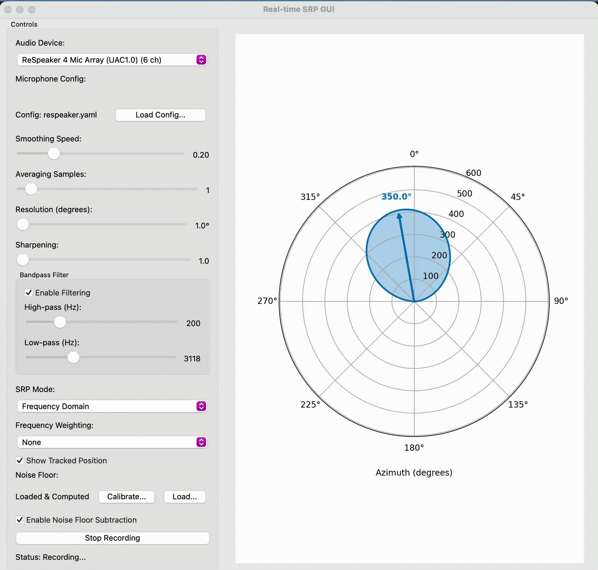

# XSRP: eXtensible Steered Response Power

This repository contains the code for the paper:

[Steered Response Power for Sound Source Localization: A Tutorial Review
](https://arxiv.org/abs/2405.02991)



## GUI Application

The repository includes a real-time GUI application for interactive sound source localization. The GUI provides:

- **Real-time polar visualization**: Live polar plots showing SRP maps and detected source directions
- **Interactive controls**: Adjustable parameters including smoothing speed, averaging samples, angular resolution, and SRP map sharpening
- **Bandpass filtering**: Configurable high-pass and low-pass filters for preprocessing
- **SRP mode selection**: Choose between time-domain and frequency-domain SRP-PHAT processing
- **Frequency weighting**: Optional frequency-domain weighting methods (coherence, sparsity, PAR) for improved source detection
- **Noise floor calibration**: Record and subtract ambient noise for improved source detection
- **Microphone configuration**: Load microphone array configurations from YAML files
- **Exponential smoothing tracker**: Temporal smoothing of DOA estimates to reduce jitter

To run the GUI:

```bash
# If installed via pip with GUI extras:
xsrp-gui

# Or during development:
uv run python -m xsrp.gui
```

## The following functionality is currently implemented:

### Core SRP Algorithms

- **Conventional SRP-PHAT in the time domain**: Taking the DFT, applying the phase transform, followed by the IDFT as described by Dibiase et al. [1]
- **Conventional SRP-PHAT in the frequency domain**: Same as above without the IDFT step, enabling per-frequency processing
- **SRP with temporal cross-correlation**: Time-domain SRP using cross-correlation without phase transform
- **Multi-source SRP**: Extension for localizing multiple simultaneous sound sources

### Signal Processing Features

- **Parabolic interpolation**: Fractional sample interpolation of the cross-correlation function for improved time resolution
- **Volumetric SRP**: Projects the average of N-closest correlation values instead of only the one associated with the microphone pair's Time Difference of Arrival (TDOA), improving robustness
- **SRP map sharpening**: Exponentiation of SRP maps to enhance peaks and suppress sidelobes
- **Bandpass filtering**: Preprocessing with configurable high-pass and low-pass filters

### Frequency-Domain Weighting Methods

Frequency-domain weighting methods for narrowband SRP maps (available in frequency-domain mode):

- **Coherence-based weighting**: Weights frequencies by spatial coherence across microphone pairs (high coherence indicates real sources, low coherence indicates noise/sidelobes)
- **Sparsity-based weighting**: Weights frequencies by the sparsity (Gini coefficient) of their SRP maps (sparse/peaked maps indicate real sources, diffuse maps indicate sidelobes)
- **Peak-to-Average Ratio (PAR)**: Weights frequencies by the ratio of peak to average SRP values (high PAR indicates dominant peaks)

### Real-Time Processing

- **Streaming SRP**: Frame-based processing for real-time audio streams
- **Exponential smoothing tracker**: Temporal smoothing of SRP maps and DOA estimates to reduce jitter
- **Noise floor calibration**: Automatic calibration and subtraction of noise floor SRP maps for improved source detection

### Grid and Visualization

- **Grid creation functions**: Support for Positional Source Localization (2D/3D Cartesian grids) and Direction of Arrival (DOA) Estimation (1D azimuth, 2D azimuth-elevation)
- **Visualization tools**: Polar plots, cross-correlation visualizations, and SRP map comparisons

## Installation

### From PyPI

Install the core package:
```bash
pip install xsrp
```

Install with GUI support (includes PyQt5, matplotlib, pyaudio, etc.):
```bash
pip install xsrp[gui]
```

After installing with GUI support, you can run the GUI application:
```bash
xsrp-gui
```

### Development Installation

We recommend using [uv](https://github.com/astral-sh/uv) for dependency management. Change directory to the ```xsrp``` folder and run the following commands:

1. Install uv (if not already installed): `curl -LsSf https://astral.sh/uv/install.sh | sh`
2. Install dependencies: `uv sync`
3. Activate the virtual environment: `source .venv/bin/activate` (or use `uv run` to run commands in the environment)

You can then optionally run the tests to verify that everything is working correctly:

4. `uv run pytest tests` (or `make test`)

You may want to check the images that were generated in the ```tests/temp``` folder.

To run the GUI during development:
```bash
uv run python -m xsrp.gui
```

